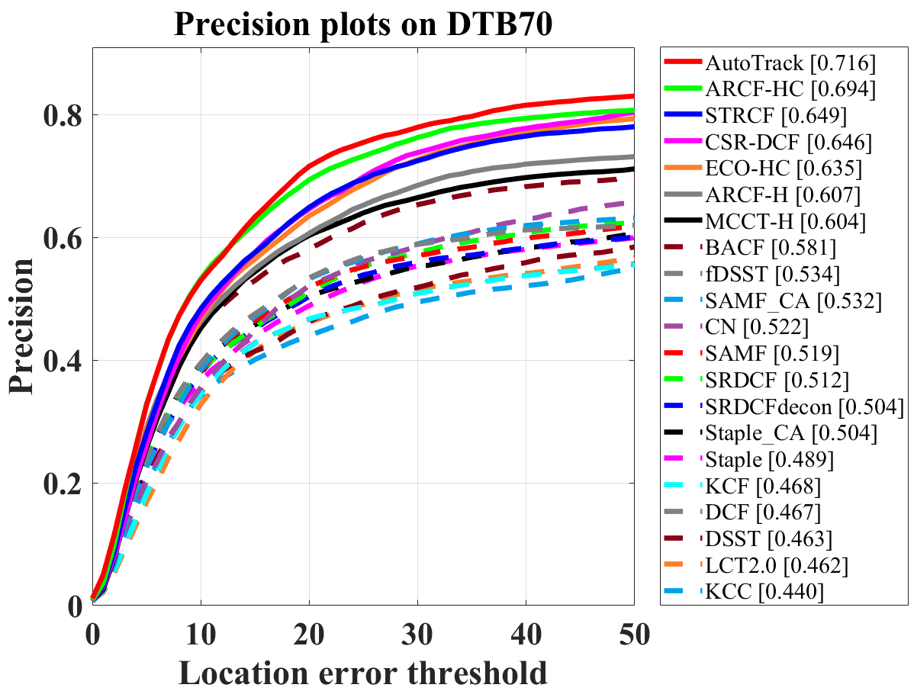
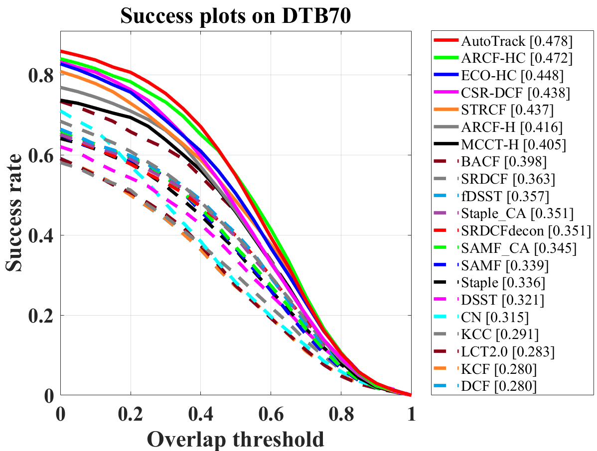
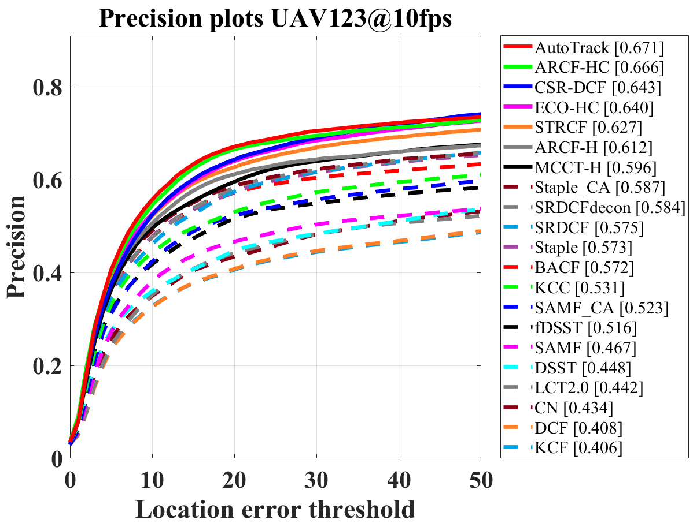
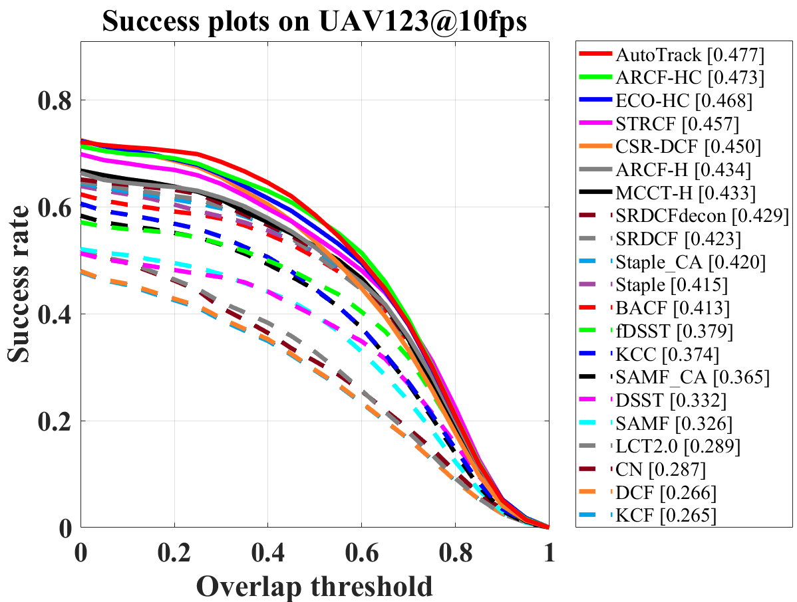
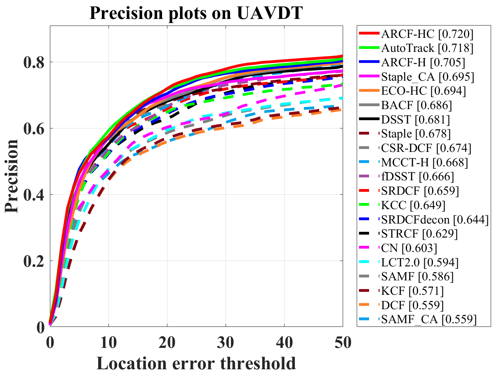
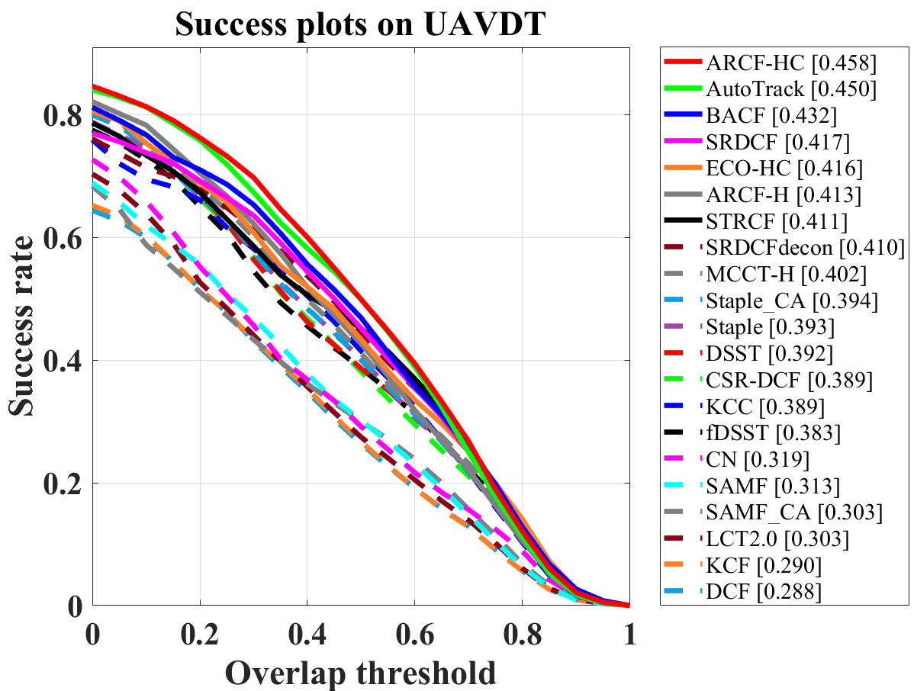
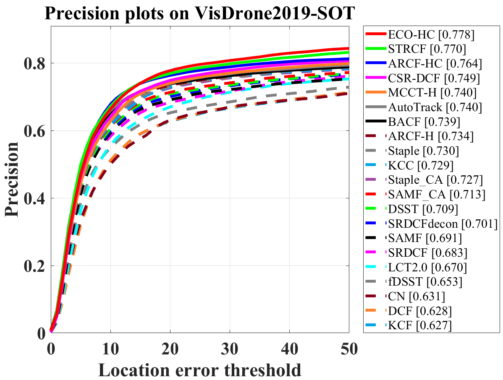
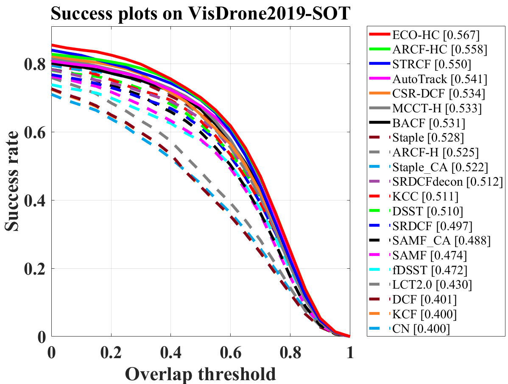
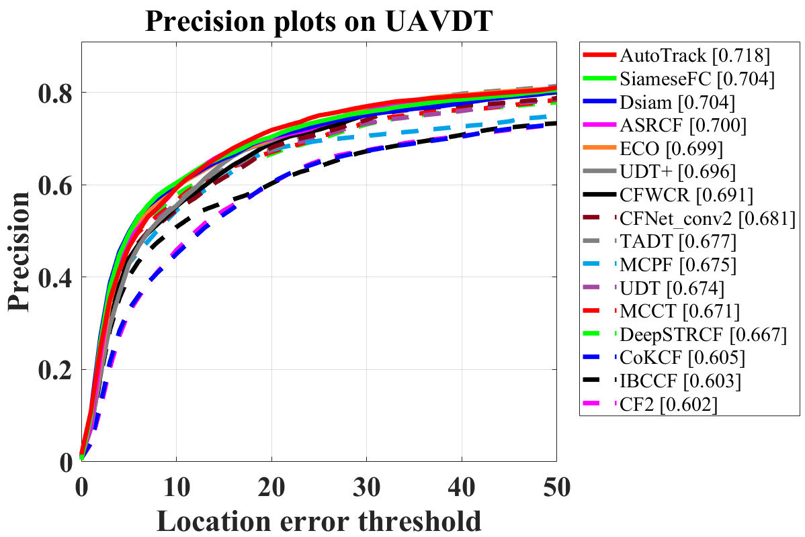

# Correlation Filter for UAV-Based Aerial Tracking: A Review and Experimental Evaluation

### Changhong Fu, Bowen Li, Fangqiang Ding, Fuling Lin, and Geng Lu

This code library gives our experimental results and most of the publicly available DCF-based trackers.

The trackers are in fold **tracker_set** and the results are in **all_trk_result**.

## Results_OPE_win10_i7_2080_R2019a

The trackers are tested on the following platform.

- windows 10 64-bit
- Intel Core i7-8700K（3.70GHz）
- 32G RAM
- Nvidia GeForce RTX 2080
- Matlab 2019a
- CUDA10
- VS2017

**All the DCF-based trackers' results are obtained using a single CPU with a single core.**

### fig

Here shows some of the tracking results of 21 handcrafted DCF-based trackers.

#### DTB70

#### UAV123@10fps

#### UAVDT

#### VisDrone2019-SOT

## UAVDT_Comparision against deep trackers

The deep trackers used GPU acceleration, while the DCF-based tracker AutoTrack used a **single CPU only**.

## Acknowledgements

We thank the contribution of  Siyi Li, Matthias Muller, Dawei Du, and Pengfei Zhu for their previous work of the benchmarks DTB70, UAV123, UAV123@10fps, UAV20L, UAVDT, and VisDrone2019-SOT. Their papers and benchmark address are listed here.

### DTB70

paper: Visual object tracking for unmanned aerial vehicles: a benchmark and new motion models

paper site: https://dl.acm.org/doi/10.5555/3298023.3298169

code and benchmark site: https://github.com/flyers/drone-tracking

### UAV123 & UAV123@10fps &UAV20L

paper: A Benchmark and Simulator for UAV Tracking 

paper site: https://link.springer.com/chapter/10.1007%2F978-3-319-46448-0_27

code and benchmark site: https://cemse.kaust.edu.sa/ivul/uav123

### UAVDT

paper: The Unmanned Aerial Vehicle Benchmark: Object Detection and Tracking  

paper site: https://link.springer.com/article/10.1007/s11263-019-01266-1

code and benchmark site: https://sites.google.com/site/daviddo0323/projects/uavdt

### VisDrone2019-SOT

paper: VisDrone-SOT2019: The Vision Meets Drone
Single Object Tracking Challenge Results  

paper site: https://ieeexplore.ieee.org/document/9022632

code and benchmark site: http://www.aiskyeye.com/  
